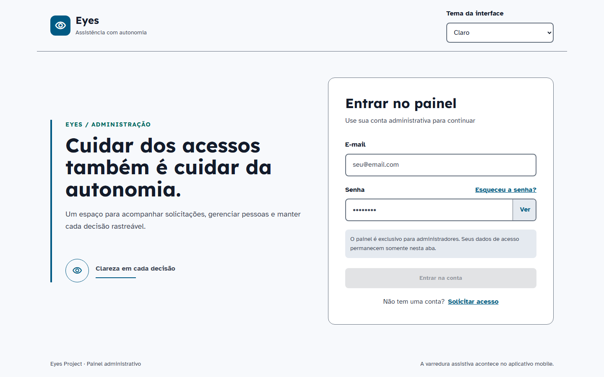
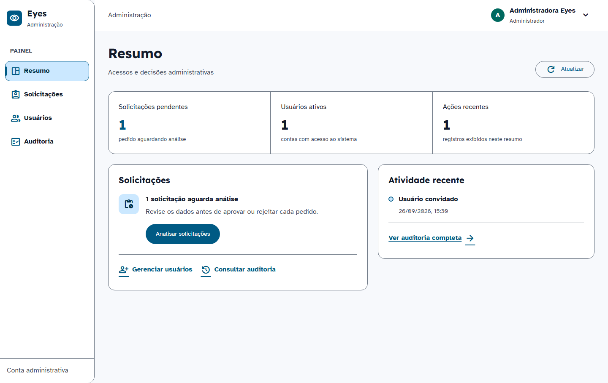
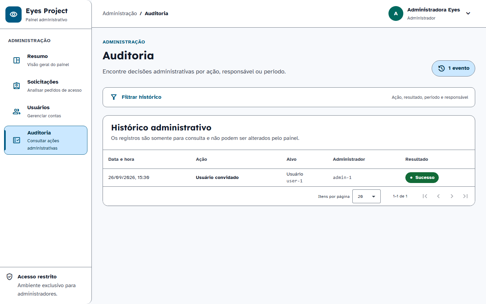

# Composição aprovada — implementação Angular (REN-59)

## Decisão e rastreabilidade

A direção v1 de REN-65 foi aprovada pelo responsável em 04/10/2026: “esta bem melhor . Boa vamos continuar avançando, seguindo com esse alto padrão de qualidade e desempenho”. A aprovação autoriza implementar a direção; a revisão das telas reais e os critérios finais de entrega continuam separados.

Referência: [direção visual no Linear](https://linear.app/renatocesar/document/direcao-visual-eyes-proposta-webmobile-ren-65-04102026-5b1b254c7d5c). A proposta e suas evidências estão no PR #19. Este documento descreve o Angular real, cujos controles Material e dados de API mantêm seus próprios comportamentos.

Base: `origin/dev` em `15270355903ca9d072aad3b384a89d3756b2f0f5`. O commit do PR #18 (`90990ba`) foi incorporado para preservar a correção de HTTP 202 no fluxo público, ainda pendente de merge. Não há alteração de contratos HTTP nesta implementação visual.

## Composição implementada

| Região | Decisão | Comportamento preservado |
| --- | --- | --- |
| Login | Marca de 36 px, apresentação curta, formulário de 416 px, título de 24 px, recuperação após a senha | Validação, exibição da senha, expiração de sessão, envio e recuperação reais |
| Navegação | Sidebar de 224 px, nomes curtos, conta e tema no header; breadcrumb permanece acessível | Drawer, destinos, papéis, foco após navegação, logout e sessão |
| Resumo | Uma faixa com três métricas; solicitações e atividade sem subtítulos repetidos | Carregamento, atualização, vazio, falha parcial/total e dados das três projeções |
| Auditoria | Filtros compactos e leitura da data, ação, alvo e resultado antes dos identificadores | UUID de ator/alvo e correlation ID no disclosure nativo, operável por teclado; filtro e paginação reais |
| Temas | Reutilização dos quatro temas, cores e fontes canônicas | Alto contraste, preferência persistida, sem novas dependências |

Identificadores de auditoria não são removidos, abreviados ou substituídos por nomes inventados. Cada linha oferece “Ver detalhes” com nome acessível específico. Texto ampliado quebra linhas e usa o fluxo vertical.

## Verificação local

- 170 testes unitários passaram em Chromium. A execução local com cobertura encontrou uma limitação de carregamento do Vitest através da junction de dependências; a execução com cobertura passou no checkout limpo da CI, run 37236984024.
- 30 testes de fluxos/acessibilidade passaram. A nova matriz cobre login, resumo e auditoria em quatro temas, larguras 320/390/1440 e texto 100%/200%: 72 combinações. Os fluxos anteriores permanecem na suíte.
- 11 capturas Windows foram atualizadas após aprovação da direção e inspecionadas; a comparação posterior passou sem atualização. As 11 referências Linux vieram do run 37236984024, foram revisadas individualmente e mostraram bytes idênticos nas três tentativas. O manifesto [approved-composition-linux.json](approved-composition-linux.json) registra origem, hashes e dimensões implícitas nos PNGs. A primeira CI falhou somente nas referências visuais antigas; 30 E2E passaram. As referências foram atualizadas com capturas Linux, preservando limites e regras; a CI do novo commit deve confirmar a comparação e o Sonar.
- Build de produção: 378,12 kB iniciais; transferência estimada de 103,25 kB. Dentro do orçamento Angular de 500 kB para aviso. Esses números não representam tempo de carregamento nem uma medição de Lighthouse.

Comandos reproduzíveis: `npm run design-system:validate`, `npm run build`, `npm run test:ci`, `npm run e2e`. O orçamento, os limites de comparação e as regras de axe permanecem ativos.

## Evidência visual

As capturas são produzidas pelas fixtures determinísticas de E2E; não representam atividade de produção.

Referências reais: `e2e/snapshots/visual-regression.spec.ts/{win32,linux}/`. A implementação aprovada substitui a composição anterior descrita em REN-54; seus contratos de navegação e dados continuam válidos. O PR registra as capturas Linux revisadas e o resultado final da CI.

## Continuidade

REN-59 entra em revisão após checks do PR. REN-66 concentra formulários e listagens restantes. O preview de REN-65 continua sendo uma referência de direção; as capturas de Angular são a evidência da implementação. Merge e publicação continuam etapas posteriores.
